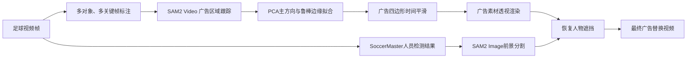

## 效果流程



## 主要功能

- 支持多个相互独立的广告平面；
- 支持同一广告位置使用多个关键帧纠正提示；
- 能够适应同一位置广告内容发生变化的情况；
- 修复 SAM2 原始蒙版碎裂、局部缺失与边缘毛刺；
- 基于广告自身主方向拟合，支持水平和倾斜广告带；
- 对四角位置进行短窗口时间平滑，降低视频抖动；
- 支持不同广告平面使用不同广告素材；
- 根据 SoccerMaster 检测框恢复运动员和裁判遮挡；
- 提供不上传图片、不内嵌比赛画面的本地浏览器标注工具。

## 项目结构

```text
SoccerBillboardLab/
├── README.md
├── LICENSE
├── THIRD_PARTY_LICENSES.md
├── requirements.txt
├── configs/
│   ├── example_annotations.json
│   └── example_ad_map.json
├── assets/
│   └── README.md
├── scripts/
│   ├── track_boards.py
│   ├── fit_geometry.py
│   ├── render_ads.py
│   └── restore_foreground.py
└── tools/
    └── annotator.html
```

## 环境要求

- 推荐使用 Linux；
- Python 3.10 或更高版本；
- SAM2 阶段需要支持 CUDA 的 NVIDIA GPU；
- PyTorch 2.4 或更高版本；
- 官方 SAM2 代码与对应模型权重；
- 可选：SoccerMaster 输出的状态压缩包，用于人物遮挡恢复。

本项目最初验证环境为：

```text
Python 3.10
PyTorch 2.4.1+cu121
NVIDIA RTX 4090D 24GB
```

## 安装

克隆本仓库：

```bash
git clone https://github.com/compassnb/SoccerBillboardLab.git
cd SoccerBillboardLab
```

建议在独立的 Conda 或 Python 虚拟环境中安装依赖：

```bash
pip install -r requirements.txt
```

按照 SAM2 官方仓库说明安装 SAM2：

```text
https://github.com/facebookresearch/sam2
```

一种常见安装方式为：

```bash
mkdir -p external
git clone https://github.com/facebookresearch/sam2.git external/sam2
pip install -e external/sam2
```

请按照 SAM2 官方说明下载对应模型权重。本仓库不提供模型权重。

## 准备视频帧

首先将视频拆分成连续编号的图片，例如：

```bash
mkdir -p data/frames

ffmpeg -i input.mp4 \
  -q:v 2 \
  data/frames/%06d.jpg
```

得到的目录格式类似：

```text
data/frames/
├── 000001.jpg
├── 000002.jpg
├── 000003.jpg
└── ...
```


## 第一步：标注广告平面

使用 Chrome 或 Edge 打开：

```text
tools/annotator.html
```

在页面中选择视频帧文件夹，然后为广告添加正样本点和负样本点。

推荐对象编号：

```text
1 = far_touchline_billboard，远侧边线广告
2 = left_goal_line_billboard，左侧底线广告
3 = right_goal_line_billboard，右侧底线广告
4 = near_touchline_billboard，近侧边线广告
5及以上 = 其他独立广告平面
```

同一物理位置的广告即使内容发生变化，也应继续使用同一个对象 ID，只需在变化后的帧增加一组纠正提示。

标注建议：

- 每个对象、每个关键帧通常使用 5～12 个分布合理的正样本点；
- 在广告上方、下方、两端外侧以及相邻平面添加负样本点；
- 镜头切换、广告重新入画、广告内容变化或跟踪漂移后增加关键帧；
- 标注不是越密越好，准确且互不矛盾比数量更重要。

标注完成后导出：

```text
board_annotations.json
```

`configs/example_annotations.json` 提供了不包含真实比赛数据的格式示例。

## 第二步：跟踪广告原始蒙版

```bash
python scripts/track_boards.py \
  --frames data/frames \
  --annotations data/board_annotations.json \
  --sam2-checkpoint /path/to/sam2.1_hiera_large.pt \
  --output-dir outputs/tracking
```

如果使用其他图片格式，可通过参数指定，例如：

```bash
--frame-pattern "*.png"
```

主要输出：

```text
outputs/tracking/raw_masks/
outputs/tracking/tracking_preview.mp4
outputs/tracking/tracking_summary.json
```

## 第三步：拟合并稳定广告几何

```bash
python scripts/fit_geometry.py \
  --frames data/frames \
  --annotations data/board_annotations.json \
  --raw-masks outputs/tracking/raw_masks \
  --output-dir outputs/geometry
```

该阶段会：

1. 提取广告蒙版的主方向；
2. 沿主方向分块采样上下边缘；
3. 进行鲁棒直线拟合；
4. 填充连续广告带；
5. 对四个角点进行时间平滑。

主要输出：

```text
outputs/geometry/clean_masks/
outputs/geometry/geometry.json
outputs/geometry/geometry_comparison.mp4
```

`geometry_comparison.mp4` 左侧是 SAM2 原始蒙版，右侧是连续拟合和时间平滑结果。

## 第四步：渲染替换广告

将拥有合法使用权的广告图片放入 `assets/`，例如：

```text
assets/demo_ad.png
```

为所有广告平面使用同一张素材：

```bash
python scripts/render_ads.py \
  --frames data/frames \
  --geometry outputs/geometry/geometry.json \
  --clean-masks outputs/geometry/clean_masks \
  --advertisement assets/demo_ad.png \
  --output-dir outputs/rendering
```

主要输出：

```text
outputs/rendering/replaced_frames/
outputs/rendering/replacement_no_occlusion.mp4
outputs/rendering/rendering_summary.json
```

如果不同广告平面需要使用不同素材，可以复制并修改：

```text
configs/example_ad_map.json
```

例如：

```json
{
  "1": "../assets/far_touchline_ad.png",
  "2": "../assets/left_goal_line_ad.png"
}
```

运行时增加：

```bash
--ad-map configs/ad_map.json
```

## 第五步：恢复人物前景遮挡

如果已经拥有 SoccerMaster 输出的 `.pklz` 状态文件，可以用检测框驱动 SAM2 Image，对真正与广告相交的运动员和裁判进行精细分割。

状态压缩包需要包含：

```text
<video_id>.pkl
<video_id>_image.pkl
```

并且标注 JSON 中的 `video_id` 应与文件名前缀一致。

运行：

```bash
python scripts/restore_foreground.py \
  --frames data/frames \
  --replaced-frames outputs/rendering/replaced_frames \
  --clean-masks outputs/geometry/clean_masks \
  --annotations data/board_annotations.json \
  --state /path/to/sn-gamestate.pklz \
  --sam2-checkpoint /path/to/sam2.1_hiera_large.pt \
  --output-dir outputs/final
```

最终视频：

```text
outputs/final/final_replacement.mp4
```


