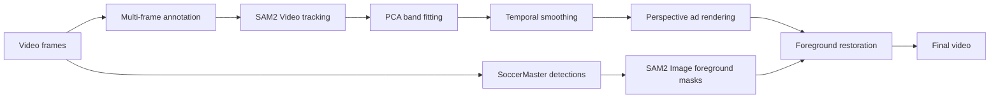

# SoccerBillboardLab

Temporally stable virtual billboard replacement for soccer videos using
multi-keyframe SAM2 tracking, robust geometric fitting, perspective rendering,
and foreground occlusion recovery.

> **Status:** research prototype. The current pipeline has been qualitatively
> validated on a short soccer clip; it is not a production-ready or real-time
> system.

## 中文简介

SoccerBillboardLab 是一个足球转播视频虚拟广告替换原型。用户只需在少量关键帧中为每个广告平面添加正负提示点，系统便可追踪广告区域、修复碎裂蒙版、平滑广告几何、进行透视贴图，并恢复运动员和裁判的前景遮挡关系。

本项目是独立研究扩展，不是 SoccerMaster 或 SAM2 的官方组件。

## Pipeline



## Features

- Multiple independent billboard planes.
- Multiple conditioning frames for the same physical billboard.
- Robust recovery from fragmented raw segmentation masks.
- Direction-independent fitting for horizontal and slanted billboard bands.
- Short-window temporal smoothing to reduce visible jitter.
- Separate advertisement image per billboard object.
- Person/referee occlusion restoration from SoccerMaster detections.
- Browser-based annotation tool with no image upload or embedded video data.

## Repository layout

```text
SoccerBillboardLab/
├── README.md
├── requirements.txt
├── THIRD_PARTY_LICENSES.md
├── configs/
│   ├── example_annotations.json
│   └── example_ad_map.json
├── assets/
│   └── README.md
├── scripts/
│   ├── track_boards.py
│   ├── fit_geometry.py
│   ├── render_ads.py
│   └── restore_foreground.py
└── tools/
    └── annotator.html
```

## Requirements

- Linux is recommended.
- Python 3.10 or newer.
- CUDA-capable GPU for SAM2 stages.
- PyTorch 2.4 or newer.
- An official SAM2 installation and checkpoint.
- Optional: a SoccerMaster state archive for foreground restoration.

## Installation

Create and activate your own Python environment, then install the basic
dependencies:

```bash
pip install -r requirements.txt
```

Install SAM2 by following the official repository:

```text
https://github.com/facebookresearch/sam2
```

Download a compatible SAM2 checkpoint using the official instructions. Model
weights are not included in this repository.

## Data preparation

Extract a video into sequentially named frames. For example:

```bash
mkdir -p data/frames
ffmpeg -i input.mp4 -q:v 2 data/frames/%06d.jpg
```

Do not commit datasets, match footage, extracted frames, checkpoints, or model
state archives to Git.

## 1. Annotate billboard planes

Open `tools/annotator.html` with Chrome or Edge, choose the frame directory,
and add positive/negative points.

Recommended object convention:

```text
1 = far_touchline_billboard
2 = left_goal_line_billboard
3 = right_goal_line_billboard
4 = near_touchline_billboard
5+ = additional independent billboard planes
```

Use the same object ID when the advertisement content changes at the same
physical location. Add another conditioning frame instead of creating a new
object.

Export the result as `board_annotations.json`.

## 2. Track raw billboard masks

```bash
python scripts/track_boards.py \
  --frames data/frames \
  --annotations data/board_annotations.json \
  --sam2-checkpoint /path/to/sam2.1_hiera_large.pt \
  --output-dir outputs/tracking
```

Main outputs:

```text
outputs/tracking/raw_masks/
outputs/tracking/tracking_preview.mp4
outputs/tracking/tracking_summary.json
```

## 3. Fit and stabilize billboard geometry

```bash
python scripts/fit_geometry.py \
  --frames data/frames \
  --annotations data/board_annotations.json \
  --raw-masks outputs/tracking/raw_masks \
  --output-dir outputs/geometry
```

Main outputs:

```text
outputs/geometry/clean_masks/
outputs/geometry/geometry.json
outputs/geometry/geometry_comparison.mp4
```

## 4. Render replacement advertisements

Use one advertisement for every plane:

```bash
python scripts/render_ads.py \
  --frames data/frames \
  --geometry outputs/geometry/geometry.json \
  --clean-masks outputs/geometry/clean_masks \
  --advertisement assets/demo_ad.png \
  --output-dir outputs/rendering
```

To use a different image for each object, copy
`configs/example_ad_map.json`, edit its paths, and add:

```bash
--ad-map configs/ad_map.json
```

Main outputs:

```text
outputs/rendering/replaced_frames/
outputs/rendering/replacement_no_occlusion.mp4
```

## 5. Restore foreground people (optional)

This stage expects a SoccerMaster-compatible `.pklz` state archive containing
`<video_id>.pkl` and `<video_id>_image.pkl`. The annotation JSON `video_id`
must match that prefix.

```bash
python scripts/restore_foreground.py \
  --frames data/frames \
  --replaced-frames outputs/rendering/replaced_frames \
  --clean-masks outputs/geometry/clean_masks \
  --annotations data/board_annotations.json \
  --state /path/to/sn-gamestate.pklz \
  --sam2-checkpoint /path/to/sam2.1_hiera_large.pt \
  --output-dir outputs/final
```

The final video is written to:

```text
outputs/final/final_replacement.mp4
```

## Annotation tips

- Use approximately 5–12 well-distributed positive points per object/keyframe.
- Place negative points above, below, and outside the billboard boundary.
- Add a keyframe after a hard camera cut, strong tracking drift, re-entry, or
  advertisement appearance change.
- More points are not always better; accurate and non-conflicting points matter
  more than point count.

## Current limitations

- Manual conditioning frames are still required.
- The fitted billboard is approximated as a long quadrilateral.
- Hard cuts require additional prompts or future shot-boundary detection.
- Foreground restoration depends on detector recall.
- Goalposts, nets, balls, and staff are not yet handled as separate occluders.
- No multi-dataset quantitative benchmark has been completed yet.

## Roadmap

- Automatic shot-boundary detection.
- Automatic billboard proposal detection.
- Tracking confidence and drift alerts.
- Goalpost, net, and ball occlusion handling.
- Illumination, motion-blur, and compression matching.
- Batch processing, caching, and resumable runs.
- Quantitative IoU, boundary, jitter, and runtime evaluation.

## Third-party projects and data

This project interoperates with third-party projects and datasets but does not
redistribute their source code, model weights, or data. Read
`THIRD_PARTY_LICENSES.md` before use or redistribution.

## License

Original code in this repository is released under the MIT License. See
`LICENSE`. This license does not override the licenses or terms of third-party
projects, model weights, datasets, or media. See `THIRD_PARTY_LICENSES.md`.
